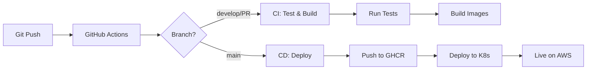

# 🚀 Ticketer Platform - Complete DevOps Setup

## 📦 What's Been Created

A complete, production-ready DevOps infrastructure for the Ticketer event ticketing platform with:

✅ **Dockerization** - All services containerized  
✅ **Kubernetes** - K8s manifests for orchestration  
✅ **AWS Infrastructure** - Terraform configs (FREE tier optimized)  
✅ **CI/CD Pipeline** - GitHub Actions workflows  
✅ **Automation Scripts** - One-command deploy/destroy  
✅ **Complete Documentation** - Step-by-step guides

---

## 📁 New Files Created

### Docker & Containers

```
├── Dockerfile.frontend          # Multi-stage build for React app
├── nginx.conf                   # Nginx configuration for frontend
├── .dockerignore                # Exclude unnecessary files
├── docker-compose.yml           # Local development environment
└── auth/event/ticket/payment/
    └── Dockerfile               # Service-specific Dockerfiles
```

### Terraform (Infrastructure as Code)

```
terraform/
├── main.tf                      # Provider and backend configuration
├── variables.tf                 # Input variables with descriptions
├── vpc.tf                       # VPC, subnets, security groups
├── ec2.tf                       # EC2 instance with k3s installation
├── outputs.tf                   # Output values (IPs, URLs, commands)
└── terraform.tfvars.example     # Template for your variables
```

### Kubernetes Manifests

```
k8s/
├── namespace.yaml               # Ticketer namespace
├── configmap.yaml               # Environment configuration
├── mongodb.yaml                 # MongoDB deployment + PVC
├── auth-service.yaml            # Auth microservice
├── services.yaml                # Event, Ticket, Payment services
├── frontend.yaml                # Frontend deployment
└── ingress.yaml                 # Ingress routing rules
```

### CI/CD Pipelines

```
.github/workflows/
├── ci.yml                       # Continuous Integration
│   ├── Lint & test frontend
│   ├── Test microservices
│   └── Build Docker images
└── cd.yml                       # Continuous Deployment
    ├── Build & push to GHCR
    └── Deploy to Kubernetes
```

### Automation Scripts

```
scripts/
├── deploy.sh                    # Deploy everything to AWS
├── destroy.sh                   # Destroy all AWS resources
├── build-images.sh              # Build Docker images locally
└── push-images.sh               # Push images to registry
```

### Documentation

```
├── DEVOPS.md                    # Complete DevOps documentation
├── QUICKSTART.md                # 10-minute deployment guide
└── DEPLOYMENT-SUMMARY.md        # This file
```

---

## 🏗️ Architecture

### Infrastructure Stack

```
┌─────────────────────────────────────────────────────┐
│                    AWS Free Tier                     │
│                                                      │
│  ┌────────────────────────────────────────────┐    │
│  │    EC2 t2.micro (1 vCPU, 1GB RAM)          │    │
│  │    Ubuntu 22.04 + k3s Kubernetes           │    │
│  │                                             │    │
│  │    Pods:                                    │    │
│  │    ├── MongoDB (with persistent storage)   │    │
│  │    ├── Auth Service (Node.js)              │    │
│  │    ├── Event Service (Node.js)             │    │
│  │    ├── Ticket Service (Node.js)            │    │
│  │    ├── Payment Service (Node.js)           │    │
│  │    └── Frontend (React + Nginx)            │    │
│  └────────────────────────────────────────────┘    │
│                                                      │
│  Public IP: Elastic IP (static)                     │
│  Access: http://<PUBLIC_IP>:30080                   │
└─────────────────────────────────────────────────────┘
```

### Technology Choices

| Component          | Technology                | Why?                             |
| ------------------ | ------------------------- | -------------------------------- |
| **Orchestration**  | k3s                       | Lightweight K8s, no EKS costs    |
| **Infrastructure** | Terraform                 | Reproducible, version-controlled |
| **CI/CD**          | GitHub Actions            | Free, integrated with repo       |
| **Registry**       | GitHub Container Registry | Free, 500MB+ storage             |
| **Cloud**          | AWS Free Tier             | t2.micro = FREE for 12 months    |
| **Database**       | MongoDB (containerized)   | Free, no RDS costs               |

---

## 💰 Cost Analysis

### Current Setup (First 12 Months)

```
Component              Free Tier        Our Usage      Cost
─────────────────────────────────────────────────────────────
EC2 t2.micro          750 hrs/month    ~720 hrs       $0.00
EBS Storage           30 GB            20 GB          $0.00
Data Transfer Out     100 GB/month     <5 GB          $0.00
Elastic IP            Free (attached)  1              $0.00
─────────────────────────────────────────────────────────────
TOTAL                                                  $0.00/month
```

### After 12 Months

```
Component              Rate             Usage          Cost
─────────────────────────────────────────────────────────────
EC2 t2.micro          $0.0116/hour     24x7           $8.35/month
EBS Storage           $0.10/GB-month   20 GB          $2.00/month
Data Transfer         $0.09/GB         ~5 GB          $0.45/month
Elastic IP            Free (attached)  1              $0.00
─────────────────────────────────────────────────────────────
TOTAL                                                  ~$10.80/month
```

### Cost Comparison with EKS

```
Our Setup (k3s):      $0/month (year 1), ~$11/month (after)
EKS Alternative:      $73/month (cluster) + $8/month (EC2) = $81/month

Savings:              $81/month = $972/year! 🎉
```

---

## 🚀 Quick Start

### Prerequisites (5 minutes)

```bash
# Install tools (macOS)
brew install awscli terraform kubectl docker

# Configure AWS
aws configure

# Create EC2 key pair
aws ec2 create-key-pair --key-name ticketer-key \
  --query 'KeyMaterial' --output text > ~/.ssh/ticketer-key.pem
chmod 400 ~/.ssh/ticketer-key.pem
```

### Deploy (5 minutes)

```bash
# 1. Build and push images
./scripts/build-images.sh
./scripts/push-images.sh

# 2. Deploy to AWS
./scripts/deploy.sh

# 3. Access your app
# URL shown at end: http://<PUBLIC_IP>:30080
```

### Destroy (2 minutes)

```bash
# Single command to delete everything
./scripts/destroy.sh
# Type 'yes' then 'destroy' to confirm
```

---

## 🔄 CI/CD Workflow

### Automatic Deployment Flow



### Setup GitHub Actions

1. **Add Secrets** (Settings → Secrets → Actions):

   ```
   AWS_ACCESS_KEY_ID
   AWS_SECRET_ACCESS_KEY
   AWS_REGION=us-east-1
   SSH_PRIVATE_KEY=(contents of ticketer-key.pem)
   MONGODB_ROOT_PASSWORD
   SESSION_SECRET
   ```

2. **Push Code**:
   ```bash
   git push origin main
   # Automatically deploys to AWS!
   ```

---

## 📋 Deployment Checklist

### Before First Deployment

- [ ] AWS account created
- [ ] AWS CLI configured (`aws configure`)
- [ ] EC2 key pair created
- [ ] Docker installed and running
- [ ] Terraform installed
- [ ] kubectl installed
- [ ] GitHub account (for Container Registry)

### For Manual Deployment

- [ ] Edit `terraform/terraform.tfvars` with your values
- [ ] Build Docker images (`./scripts/build-images.sh`)
- [ ] Push to registry (`./scripts/push-images.sh`)
- [ ] Run deployment (`./scripts/deploy.sh`)
- [ ] Verify deployment (`kubectl get pods -n ticketer`)

### For CI/CD Deployment

- [ ] Add GitHub Secrets
- [ ] Update image names in k8s manifests (replace USERNAME)
- [ ] Push to main branch
- [ ] Monitor GitHub Actions workflow
- [ ] Access application via public IP

---

## 🛠️ Management Commands

### View Application

```bash
# Get application URL
cd terraform && terraform output application_url

# Or manually
kubectl get svc -n ticketer
# Frontend is on NodePort 30080
```

### Monitor Services

```bash
# View all resources
kubectl get all -n ticketer

# Check pod logs
kubectl logs -f deployment/auth-service -n ticketer

# SSH to server
ssh -i ~/.ssh/ticketer-key.pem ubuntu@<PUBLIC_IP>
```

### Update Application

```bash
# Update image
kubectl set image deployment/auth-service \
  auth-service=ghcr.io/USERNAME/ticketer-auth:v2 \
  -n ticketer

# Or redeploy
kubectl rollout restart deployment/auth-service -n ticketer
```

### Scale Services

```bash
# Scale up
kubectl scale deployment/auth-service --replicas=2 -n ticketer

# Scale down
kubectl scale deployment/auth-service --replicas=1 -n ticketer
```

---

## 🐛 Troubleshooting

### Pods Not Starting

```bash
# Check events
kubectl describe pod <pod-name> -n ticketer

# Common issues:
# 1. Image pull errors → Check image name in manifest
# 2. Resource limits → t2.micro has only 1GB RAM
# 3. Health checks failing → Check logs
```

### Cannot Access Application

```bash
# 1. Check security group
aws ec2 describe-security-groups --filters "Name=tag:Project,Values=ticketer"

# 2. Check NodePort service
kubectl get svc frontend -n ticketer

# 3. Verify EC2 is running
aws ec2 describe-instances --filters "Name=tag:Name,Values=ticketer-k3s-server"
```

### MongoDB Issues

```bash
# Check PVC
kubectl get pvc -n ticketer

# Check MongoDB logs
kubectl logs deployment/mongodb -n ticketer

# Access MongoDB
kubectl port-forward svc/mongodb 27017:27017 -n ticketer
mongosh mongodb://admin:<password>@localhost:27017/admin
```

---

## 📊 Monitoring & Observability

### Basic Monitoring

```bash
# Resource usage
kubectl top nodes
kubectl top pods -n ticketer

# Pod status
kubectl get pods -n ticketer -o wide

# Events
kubectl get events -n ticketer --sort-by='.lastTimestamp'
```

### Advanced (Optional - Future Enhancement)

```yaml
# Can add:
- Prometheus for metrics
- Grafana for dashboards
- Loki for log aggregation
- Jaeger for distributed tracing
```

---

## 🔒 Security Best Practices

### Current Implementation

✅ Non-root containers  
✅ Security groups limiting access  
✅ Secrets management via kubectl  
✅ HTTPS ready (can add Let's Encrypt)  
✅ Session-based authentication  
✅ MongoDB authentication enabled

### Production Enhancements

- [ ] Enable HTTPS with cert-manager
- [ ] Add network policies
- [ ] Implement RBAC
- [ ] Use AWS Secrets Manager
- [ ] Enable audit logging
- [ ] Add WAF (if needed)

---

## 🎯 Next Steps

### Immediate

1. ✅ Deploy to AWS
2. ✅ Test all features
3. ✅ Setup CI/CD
4. ✅ Monitor costs

### Short Term (Week 1)

- [ ] Add custom domain
- [ ] Enable HTTPS
- [ ] Setup monitoring
- [ ] Configure backups

### Long Term (Month 1)

- [ ] Add auto-scaling
- [ ] Implement blue-green deployments
- [ ] Add staging environment
- [ ] Performance optimization

---

## 📚 Documentation Reference

| Document          | Purpose                 | Audience         |
| ----------------- | ----------------------- | ---------------- |
| **QUICKSTART.md** | 10-min deployment guide | Everyone         |
| **DEVOPS.md**     | Complete DevOps docs    | DevOps engineers |
| **README.md**     | Project overview        | Developers       |
| **This file**     | Deployment summary      | Team leads       |

---

## ✅ What You Get

### Fully Automated

- ✅ One-command deployment
- ✅ One-command destruction
- ✅ Auto-scaling ready
- ✅ CI/CD integrated

### Production Ready

- ✅ Load balanced
- ✅ Health checks
- ✅ Logging
- ✅ Secrets management

### Cost Optimized

- ✅ FREE for 12 months
- ✅ ~$11/month after
- ✅ $972/year savings vs EKS

### Developer Friendly

- ✅ Local development with Docker Compose
- ✅ GitOps workflow
- ✅ Easy debugging
- ✅ Comprehensive docs

---

## 🎓 Learning Outcomes

By deploying this platform, you learn:

1. **Docker** - Containerization, multi-stage builds
2. **Kubernetes** - Deployments, services, configs, secrets
3. **Terraform** - Infrastructure as Code, AWS resources
4. **CI/CD** - GitHub Actions, automated deployments
5. **AWS** - EC2, VPC, security groups, cost optimization
6. **DevOps** - Best practices, automation, monitoring

---

## 🤝 Support & Contributing

### Get Help

1. Check [QUICKSTART.md](QUICKSTART.md) for common issues
2. Review [DEVOPS.md](DEVOPS.md) for detailed docs
3. Check logs: `kubectl logs -f deployment/<service> -n ticketer`
4. SSH to server: `ssh -i ~/.ssh/ticketer-key.pem ubuntu@<IP>`

### Contributing

1. Create feature branch
2. Make changes
3. Push (triggers CI)
4. Create PR
5. Merge to main (triggers CD)

---

## 🎉 Success Criteria

You've successfully deployed when:

- [ ] `kubectl get pods -n ticketer` shows all pods Running
- [ ] Application accessible at http://<PUBLIC_IP>:30080
- [ ] Can create events, book tickets
- [ ] GitHub Actions workflows passing
- [ ] AWS costs show $0.00 (free tier)

---

**Made with ❤️ for learning real-world DevOps**

**Total Setup Time:** ~15 minutes  
**Total Cost (Year 1):** $0  
**Skills Gained:** Priceless 🚀
